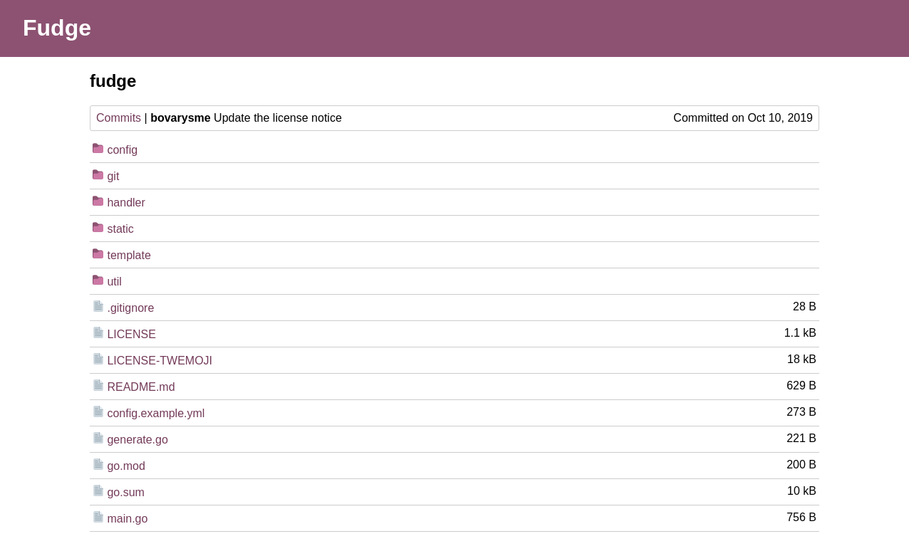

# fudge

The delicious Git WebUI.

## Usage

- Move `config.example.yml` to `config.yml` and edit it.
- Run `go run main.go`.

## License

This project is licensed under the terms of the MIT license. See
[LICENSE](LICENSE) for details.

The colours used in [syntax.go](util/syntax.go) are taken from the
[ayu](https://github.com/dempfi/ayu) theme, licensed under the terms of the MIT
license by Ike Ku.

The images [blob.svg](static/img/blob.svg) and [tree.svg](static/img/tree.svg)
are licensed under the terms of the CC-BY 4.0 license by Twitter, Inc and other
contributors. See [LICENSE-TWEMOJI](LICENSE-TWEMOJI) for details.
